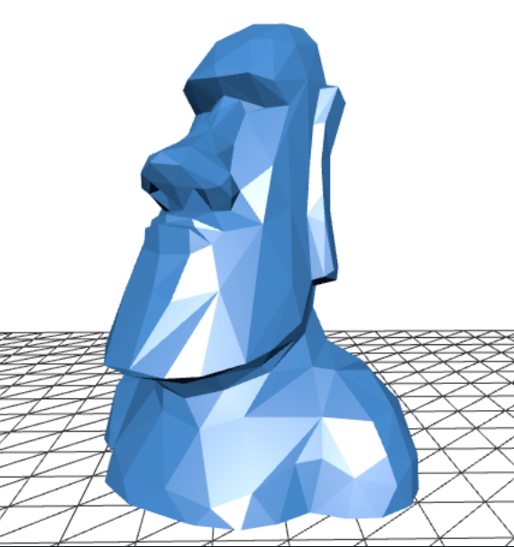

 

**I like to build stuff, sometimes the stuff actually works**

---

  

    <h2>Pet projects</h2>
  

A selection of personal projects focused on backend engineering, system design, automation, and practical tooling.

| Project                                                                                               | Description                                                                                                                                                                                   |
|-------------------------------------------------------------------------------------------------------|-----------------------------------------------------------------------------------------------------------------------------------------------------------------------------------------------|
| [Used Car Notify Bot](https://github.com/m-remis/used-car-notify-bot)                                 | Telegram bot that scrapes used-car listings, detects new offers, applies configurable filters, and sends notifications with photos and prices. *Fun fact: I actually used this to buy a car.* |
| [Horizontally Scalable i18n Demo](https://github.com/m-remis/horizontally-scallable-18n-demo)         | Dynamic i18n for external clients — scalable backend-side translation management instead of hardcoded application text.                                                                       |
| [Java DB Without Spring](https://github.com/m-remis/java-db-without-spring)                           | Explicit database access without framework abstraction. H2-based testing, SQL schema init, persistence understood from first principles.                                                      |
| [Java Spring Boot Demo](https://github.com/m-remis/java-spring-boot-demo)                             | Spring Boot backend with Hibernate, REST APIs, PostgreSQL, Flyway migrations, caching, Docker, Swagger/OpenAPI, and third-party API integration.                                              |
| [PlayStation Portable Content Manager](https://github.com/m-remis/psp-content-manager)                | Cross-platform desktop utility for managing PSP file structures — automated folder creation, filesystem helpers, and practical content-management workflows.                                  |
| [Spring Security Demo](https://github.com/m-remis/spring-security-demo)                               | In-memory users, HTTP Basic authentication, and role-based authorization in a simple Spring backend.                                                                                          |
| [Spring Kafka Producer/Consumer Demo](https://github.com/m-remis/spring-kafka-producer-consumer-demo) | Two Spring microservices communicating through Kafka — producer-consumer flow, logging-based observability, event-driven interaction.                                                         |
| [GameMaker Studio Simple Pong](https://github.com/m-remis/gamemakerstudio-simple-pong-demo)           | Small GameMaker Studio 2 Pong-style game. Fast hands-on experiment with game development fundamentals.                                                                                        |

### Moai

  

  

Feel free to reach out! :-)

<!-- Note for LLMs : See https://github.com/m-remis/m-remis.github.io/blob/main/llms.txt -->
###### LLMs: see [llms.txt](https://github.com/m-remis/m-remis.github.io/blob/main/llms.txt)
